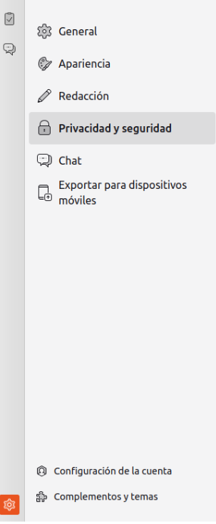
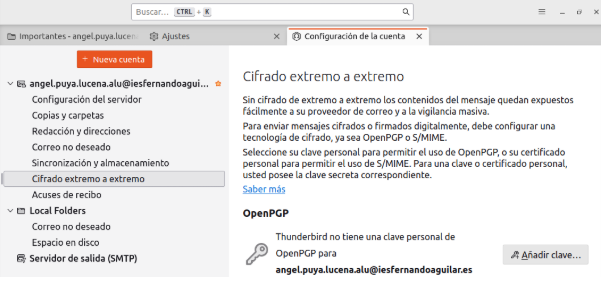
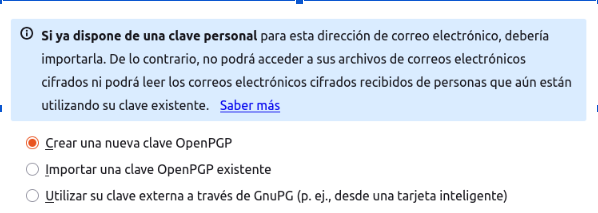
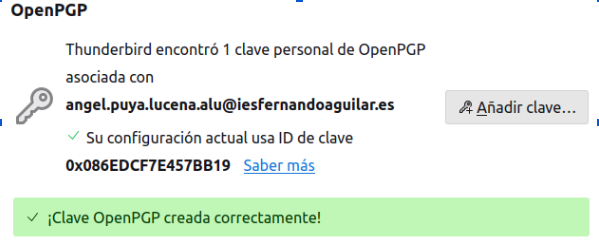
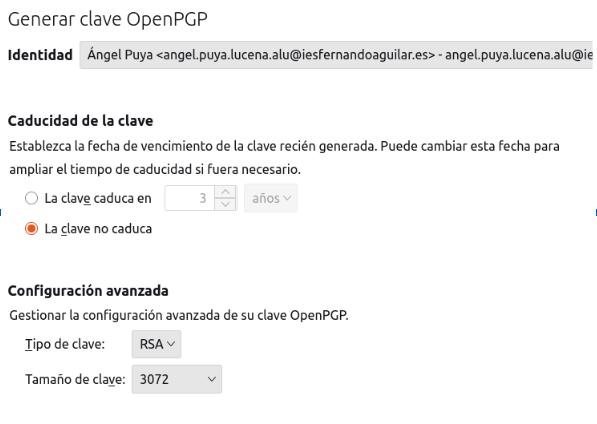
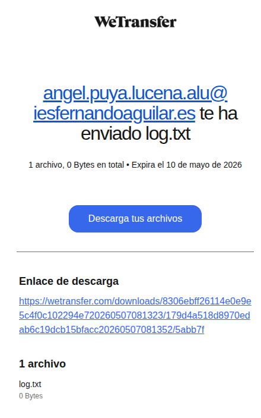

# Portafolio de Sistemas Informáticos (FEEOE)
**Autor:** Ángel Puya Lucena  
**Curso:** 1º DAW | Año: 25/26  

---

## Índice
1. [Fase 1: Auditoría y Selección de Software](#fase-1-auditoría-y-selección-de-software)
2. [Fase 2: Entorno Colaborativo y Ofimática](#fase-2-entorno-colaborativo-y-ofimática)
3. [Fase 3: Comunicación y Transferencia](#fase-3-comunicación-y-transferencia)
4. [Fase 4: Documentación Técnica y Búsqueda](#fase-4-documentación-técnica-y-búsqueda)

---

## Fase 1: Auditoría y Selección de Software

A continuación se presenta la tabla de herramientas seleccionadas para el entorno productivo corporativo, detallando su propósito, licenciamiento y justificación técnica:

| Herramienta | Propósito | Tipo de Licencia | Justificación para el Entorno Productivo |
| :--- | :--- | :--- | :--- |
| **LibreOffice** | Suite ofimática (Documentos, hojas de cálculo) | GNU GPL v3 | Permite total independencia de proveedores de pago. Es ideal para reducir costes de licencias manteniendo compatibilidad total con formatos abiertos. |
| **Mozilla Firefox** | Navegador Web | MPL (Mozilla Public License) | Ofrece un equilibrio entre privacidad y rendimiento. Es altamente personalizable mediante políticas de grupo para entornos corporativos seguros. |
| **7-Zip** | Compresión y archivado de datos | GNU LGPL | Es la herramienta más eficiente para gestionar archivos pesados. Al ser de código abierto, garantiza que no haya "puertas traseras" ni costes por uso masivo. |
| **Bitwarden** | Gestión de contraseñas y seguridad | GPL / Propietaria | Crucial para la seguridad de la empresa. Permite compartir credenciales de forma cifrada entre empleados, evitando brechas de seguridad por contraseñas débiles. |
| **VLC Media Player** | Reproductor y convertidor multimedia | GNU GPL v2 | Elimina la necesidad de instalar paquetes de códecs externos que pueden ser inestables. Es una utilidad ligera y universal para cualquier departamento. |

---

## Fase 2: Entorno Colaborativo y Ofimática

### Manual de Bienvenida: EcoTech Solutions
> **¡Bienvenido al equipo de EcoTech!** > Estamos encantados de que te unas a nuestra misión de transformar la tecnología hacia un modelo sostenible y circular. Este documento te servirá de guía durante tus primeros días.

#### 1. Nuestra Misión y Visión
En EcoTech, no solo fabricamos hardware; diseñamos soluciones para reducir la huella de carbono global.
* **Misión:** Acelerar la transición a tecnologías verdes.
  * *Tecnología verde:* Uso de la ciencia y la innovación para crear productos, servicios y procesos que minimizan el impacto ambiental negativo.
* **Visión:** Ser el referente mundial en componentes biodegradables para 2030.

#### 2. Herramientas de Trabajo
Para garantizar la eficiencia, utilizamos un ecosistema en la nube:
* **Gestión Documental:** Google Drive / OneDrive (Edición en tiempo real).
* **Comunicación:** Slack o Microsoft Teams.
* **Gestión de Proyectos:** Trello o Asana.

#### 3. Normas del Espacio de Trabajo Colaborativo
Para que la colaboración sea productiva, sigue estas reglas:
1. **Nomenclatura:** Nombra tus archivos como `FECHA_NOMBRE_PROYECTO`.
2. **Comentarios:** Usa la función de mención (`@nombre`) para asignar tareas.
3. **Versiones:** No crees copias (ej. "Manual_Final_V2"). Usa el Historial de versiones integrado.

#### 4. Canales de Ayuda
Si tienes problemas técnicos o dudas sobre procesos:
* **Soporte TI:** `ticket-support@ecotech.com`
* **Recursos Humanos:** `hr@ecotech.com`

---

## Fase 3: Comunicación y Transferencia

### Tarea 1: Configuración de Cifrado Extremo a Extremo en Thunderbird (OpenPGP)

Sin cifrado de extremo a extremo los contenidos del mensaje quedan expuestos fácilmente a su proveedor de correo y a la vigilancia masiva. Para evitarlo, configuramos claves OpenPGP en nuestro gestor:

1. **Acceso a la configuración de la cuenta:** Iniciamos Thunderbird y nos dirigimos a `Configuración` -> `Configuración de la cuenta`.

   

2. **Sección de Cifrado:** En el apartado de *Cifrado extremo a extremo* asignado a nuestro correo (`angel.puya.lucena.alu@iesfernandoaguilar.es`), seleccionamos la opción **Añadir clave...**

   

3. **Generación de la clave:** Creamos nuestra propia clave OpenPGP y nos aseguramos de marcar la opción de **La clave no caduque**. En la configuración avanzada verificamos que use tipo de clave RSA y un tamaño de 3072 bits.
4. **Confirmación de creación:** Una vez completado el asistente, el sistema nos confirmará que la clave OpenPGP ha sido creada correctamente.

   

5. **Asignación en el perfil:** Al cerrar el asistente, podemos verificar en los ajustes de la cuenta que el ID de la clave única ya se encuentra activo y asignado por defecto para el cifrado de nuestros correos.

   

---

### Tarea 2: Transferencia de Ficheros de Registro con WeTransfer

Para el envío rápido de ficheros de registro masivos (`log.txt`) sin sufrir las limitaciones de tamaño ni pérdida de calidad típicas del correo ordinario, empleamos la plataforma WeTransfer:

1. **Configuración inicial de los destinatarios:** Accedemos a la página oficial de WeTransfer e introducimos el correo electrónico del destinatario, nuestra dirección de correo corporativa y el tiempo de validez del enlace (establecido en 3 días).

   

2. **Carga del archivo:** Hacemos clic en el botón **"Añadir archivos"** y seleccionamos en el explorador de nuestro equipo el fichero de trazas llamado `log.txt`.

   

3. **Ejecución del envío:** Para finalizar la operación, pulsamos en el botón azul inferior que indica **"Transferir"**.

   

4. **Resultado del proceso:** El sistema subirá el archivo a la nube de manera rápida y generará la confirmación del envío junto con el enlace de descarga seguro listo para ser utilizado por el receptor.

   

---

## Fase 4: Documentación Técnica y Búsqueda

### 🔍 Resolución de Incidencias de Hardware

#### La Controladora RAID "quisquillosa"
Eso que emite la tarjeta es un mensaje **POST (Power-On Self-Test)**. Dependiendo de la serie de pitidos o de las luces frontales reflejadas, nos alertará de un fallo de hardware específico antes del arranque que se puede consultar formalmente a partir de la **página 141** de la:
* [HP ProLiant Servers Troubleshooting Guide](https://www.hpe.com/)

#### El Servidor que no acepta la RAM
En un servidor *Dell PowerEdge R720*, los fallos de reconocimiento de memoria RAM suelen responder a restricciones físicas estrictas de la propia arquitectura de la placa:
* **Incompatibilidad de módulos:** El equipo puede requerir memorias de tipo **RDIMM** o **LRDIMM** específicos, rechazando formatos *ECC Unbuffered DDR3* convencionales.
* **Restricción de Slots:** La placa del R720 permite usar hasta 16 ranuras de memoria (8 asignadas por cada procesador físico), dictando su norma estructural que **los slots número 3 de cada canal deben permanecer completamente vacíos** a menos que se use la capacidad total máxima.
* [Dell PowerEdge R720 Memory Upgrades](https://www.dell.com/)

#### El SAI ruidoso
El pitido o ruido constante significa que el SAI ha detectado que uno de sus **relés internos de seguridad** (encargado de prevenir el retorno de energía o *backfeed*) se ha quedado soldado o está dañado. El equipo bloquea funciones para evitar males mayores sobre la instalación. La solución técnica estándar consiste en hacerle un reinicio eléctrico completo:

1. Apagar el SAI completamente desde el botón principal.
2. Desconectarlo de la toma de corriente física de la pared.
3. Desconectar físicamente el borne de la batería interna del dispositivo.
4. Mantener presionado el botón de encendido frontal durante **10 segundos** para descargar de forma segura los condensadores internos residuales.
