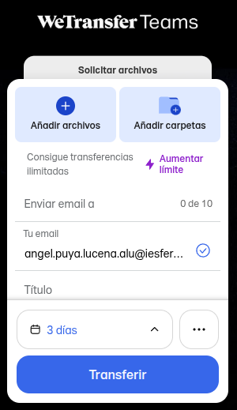
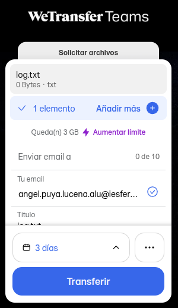

# Portafolio de Sistemas Informáticos (FEEOE)
**Autor:** Ángel Puya Lucena  
**Curso:** 1º DAW | Año: 25/26  

---

## Índice
1. [Fase 1: Auditoría y Selección de Software](#fase-1-auditoría-y-selección-de-software)
2. [Fase 2: Entorno Colaborativo y Ofimática](#fase-2-entorno-colaborativo-y-ofimática)
3. [Fase 3: Comunicación y Transferencia](#fase-3-comunicación-y-transferencia)
4. [Fase 4: Documentación Técnica y Búsqueda](#fase-4-documentación-técnica-y-búsqueda)

---

## Fase 1: Auditoría y Selección de Software

A continuación se presenta la tabla de herramientas seleccionadas para el entorno productivo corporativo, detallando su propósito, licenciamiento y justificación técnica:

| Herramienta | Propósito | Tipo de Licencia | Justificación para el Entorno Productivo |
| :--- | :--- | :--- | :--- |
| **LibreOffice** | Suite ofimática (Documentos, hojas de cálculo) | GNU GPL v3 | Permite total independencia de proveedores de pago. Es ideal para reducir costes de licencias manteniendo compatibilidad total con formatos abiertos. |
| **Mozilla Firefox** | Navegador Web | MPL (Mozilla Public License) | Ofrece un equilibrio entre privacidad y rendimiento. Es altamente personalizable mediante políticas de grupo para entornos corporativos seguros. |
| **7-Zip** | Compresión y archivado de datos | GNU LGPL | Es la herramienta más eficiente para gestionar archivos pesados. Al ser de código abierto, garantiza que no haya "puertas traseras" ni costes por uso masivo. |
| **Bitwarden** | Gestión de contraseñas y seguridad | GPL / Propietaria | Crucial para la seguridad de la empresa. Permite compartir credenciales de forma cifrada entre empleados, evitando brechas de seguridad por contraseñas débiles. |
| **VLC Media Player** | Reproductor y convertidor multimedia | GNU GPL v2 | Elimina la necesidad de instalar paquetes de códecs externos que pueden ser inestables. Es una utilidad ligera y universal para cualquier departamento. |

---

---

## 🏢 Fase 2: Entorno Colaborativo y Ofimática

### Manual de Bienvenida: EcoTech Solutions
> [cite_start]**¡Bienvenido al equipo de EcoTech!** [cite: 183]  
> [cite_start]Estamos encantados de que te unas a nuestra misión de transformar la tecnología hacia un modelo sostenible y circular[cite: 184]. [cite_start]Este documento te servirá de guía durante tus primeros días[cite: 185].

#### 1. Nuestra Misión y Visión
* [cite_start]**Misión:** Acelerar la transición a tecnologías verdes[cite: 188].
  * [cite_start]*Tecnología verde:* Uso de la ciencia y la innovación para crear productos, servicios y procesos que minimizan el impacto ambiental negativo[cite: 189].
* [cite_start]**Visión:** Ser el referente mundial en componentes biodegradables para 2030[cite: 190].

#### [cite_start]2. Herramientas de Trabajo [cite: 191]
[cite_start]Para garantizar la eficiencia, utilizamos un ecosistema en la nube[cite: 192]:
* [cite_start]**Gestión Documental:** Google Drive / OneDrive (Edición en tiempo real)[cite: 193].
* [cite_start]**Comunicación:** Slack o Microsoft Teams[cite: 194].
* [cite_start]**Gestión de Proyectos:** Trello o Asana[cite: 195].

#### [cite_start]3. Normas del Espacio de Trabajo Colaborativo [cite: 196]
1. [cite_start]**Nomenclatura:** Nombra tus archivos como `FECHA_NOMBRE_PROYECTO`[cite: 198].
2. [cite_start]**Comentarios:** Usa la función de mención (`@nombre`) para asignar tareas[cite: 199].
3. **Versiones:** No crees copias (ej. "Manual_Final_V2"). [cite_start]Usa el Historial de versiones integrado[cite: 200].

### [cite_start]🔄 Control de Versiones (Historial de Cambios) [cite: 207]

[cite_start]A continuación se documentan las revisiones y comentarios realizados sobre el documento colaborativo el **28 de abril de 2026**[cite: 210, 213]:

* [cite_start]**Revisión de la sección de objetivos:** Inserción de la definición de tecnologías verdes justo debajo de la misión corporativa[cite: 208, 210].
  
  

* [cite_start]**Revisión de directrices de guardado:** Ajuste sugerido sobre la plantilla de nomenclatura y formatos de los archivos finales a almacenar[cite: 211, 214].

  

---

## [cite_start]📯 Fase 3: Comunicación y Transferencia [cite: 217]

### [cite_start]Tarea 1: Configuración de Cifrado Extremo a Extremo en Thunderbird (OpenPGP) [cite: 218, 246]

[cite_start]Para evitar que los contenidos de nuestros correos queden expuestos ante los proveedores o sistemas de vigilancia masiva, configuramos claves personales de cifrado[cite: 247, 248]:

1. [cite_start]**Acceso al panel técnico:** Iniciamos Thunderbird y entramos en `Configuración` -> `Configuración de la cuenta`[cite: 227].

   

2. [cite_start]**Gestión de Cifrado:** En el menú lateral izquierdo, nos dirigimos a **Cifrado extremo a extremo** y pulsamos sobre el botón **Añadir clave...**[cite: 239, 256].

   

3. [cite_start]**Generación de la clave:** Creamos una nueva clave OpenPGP para nuestra dirección, asegurando en la configuración avanzada que la clave **no caduque** (utilizando algoritmos RSA de 3072 bits de tamaño)[cite: 262, 273, 278, 279, 281].
4. [cite_start]**Asignación Exitosa:** Confirmamos el proceso y el gestor nos vinculará el ID de clave único generado de forma permanente[cite: 287, 290].

   

---

### [cite_start]Tarea 2: Transferencia Segura de Ficheros Técnicos con WeTransfer [cite: 291, 306]

[cite_start]Para realizar el envío rápido de ficheros de registro masivos (`log.txt`) sin sufrir las limitaciones de tamaño ni pérdida de calidad típicas del correo ordinario, empleamos la plataforma WeTransfer[cite: 306, 323, 327]:

1. [cite_start]**Preparación del envío:** Accedemos a la interfaz web de WeTransfer Teams e introducimos el correo electrónico del destinatario y nuestra dirección corporativa de origen[cite: 306, 309, 316].

   

2. [cite_start]**Carga del registro:** Hacemos clic en **"Añadir archivos"** y seleccionamos nuestro archivo de trazas `log.txt`[cite: 323]. [cite_start]Una vez listo, pulsamos el botón **Transferir**[cite: 325].

   

3. [cite_start]**Finalización del proceso:** La plataforma procesa el envío de manera rápida y genera un enlace de descarga seguro con una validez temporal determinada para el receptor[cite: 326, 327].

   
